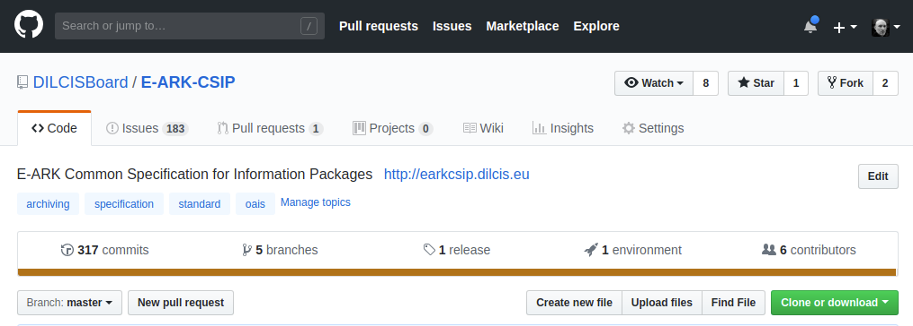
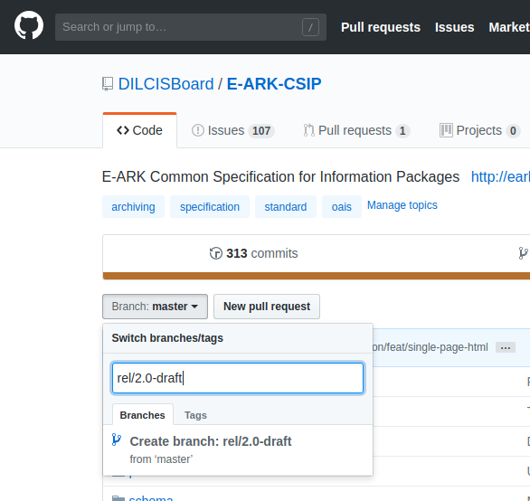

## Contributing the specification process
We use [GitHub](https://github.com/) to organise, assign and review the work of
the specification group. This means that to participate you'll need to sign up
to [GitHub and get a GitHub id](https://github.com/join).

## Writing on GitHub
Most of your interaction with GitHub itself will be via it's online forms, which
are generally simple. Most forms provide a free text box for comments and/or a
description. While plain text is fine it lacks even rudimentary formatting. Most
places where you can enter free text on GitHub support [Markdown](https://daringfireball.net/projects/markdown/), specifically [GitHub flavoured Markdown](https://guides.github.com/features/mastering-markdown/).
This document is also written in Markdown.

## Providing feedback using GitHub issues
The simplest way of contributing is to provide feedback on the specification using
[GitHub Issues](https://guides.github.com/features/issues/). Each project has it's
own issue tracker which can be found using the Issues tab on the GitHub project page
or appending `/issues` to the projects GitHub URL. As a quick example the GitHub
issues page for the Common Specification project is available here:
https://github.com/DILCISBoard/E-ARK-CSIP/issues. The GitHub instructions for
[creating an issue are here](https://help.github.com/en/articles/creating-an-issue).

## Providing a Contribution as a Pull Request
The branch arrangement [described here](GITHUB_GUIDE.md) allows changes to be made to a specific
version of a specification. These can then be reviewed by a member of the DILCIS
Board before publication. Changes are submitted as [GitHub pull requests](https://help.github.com/en/articles/about-pull-requests). A pull request
is simply a set of edits made to a specification. Each pull request is made against
a specific branch. It can be tricky working out which branch to use when submitting
a pull request. Here are a few guidelines:

- pull requests should rarely, if ever, be made against the master branch. This is
the officially released branch and doesn't contain the latest changes;
- pull requests should usually be created using the branch that represents the
version you wish to amend, for instance changes to version 2.0 of the CSIP should
be made agains the `rel/2.0` branch; and
- if you submit a PR against the wrong branch don't worry, there's no harm done and
a member of the review team will get in touch and help.

### Pull Request Style
When providing contributions as pull requests remember that small is beautiful. If you're
planning to provide a number of changes please break them down into multiple pull
requests rather than bundle them into a single contribution. Here's why:

- small pull requests are easier to review;
- review responsibilities can be split across multiple contributions; and
- if there's a review issue with a single part of a large pull request then none
of the work contributed can be merged.

Be sure to provide a detailed description of the changes you're submitting using the
pull request form. This makes it easier for reviewers to evaluate your contribution.
 
### Cloning a Repository
In order to create a pull request it's usually best to create your own copy of the
[repository on GitHub](https://help.github.com/en/articles/cloning-a-repository),
known as a fork or a clone. You'll need a GitHub account to fork a repository.
If you have one you simply need to press the fork button shown in the top right of
the repository's home screen:

You can then make the changes you want, either on a working copy of the repository
on your own machine, or [using GitHub's web editor](https://help.github.com/en/articles/editing-files-in-your-repository). Once
your changes are ready you can [submit them as a pull request](https://help.github.com/en/articles/creating-a-pull-request), been sure to
select the appropriate branch. Again if you make a mistake someone will get in touch
to help.

#### Creating new Branch
To create a new branch on GitHub follow these steps:

1. From the repo home page ensure that the branch you wish to copy, in this case master, is selected.
2. Hit the pull down button and type the new branch name. In the image below we're creating the `rel/2.0-draft` branch.
3. Click the "Create branch: rel/2.0-draft" panel. The name will be that of the branch you're creating. Check the "from 'master'" tag to ensure you're cloning the branch you intend, in this case master.

