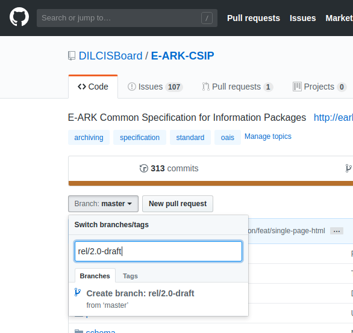

This document provides an introduction for those unfamiliar with Git and GitHub’s support for branching and versioning. It uses the development of the Common Specification for Information Packages to illustrate the points. We’ll start by looking at the current state of play with the CSIP.

## Git / GitHub Concepts
There are four Git concepts that need to be understood: commits, tags, branches / branching, and pull requests.

### Commits
Commits are checked in units of work on a document. This is a simple model where by an author makes changes to a file or files in the repository and then checks them into the repository. This check in is a commit and it records:
- the email and id of the author who made the change with the time and date of the check in;
- a comment by the commit author describing the changes;
- a record of the changes made; and
- a unique SHA1 identifier for the check in itself.

Here’s an illustration of a small commit to the CSIP repository, it simply changes the version number and publication date: https://github.com/DILCISBoard/E-ARK-CSIP/commit/afaededeabb82d1b6afb0e10154e6ac9c3518a60 the long last part of the URL is the SHA1 id of the commit itself. Work is built up as a chain of commits. Ideally an individual commit should be small as it makes tracking changes and rolling back work easier. The name commit is derived from the act of committing a change to the permanent record by checking the work into a repository.

### Tags
A tag is a effectively a bookmark to an individual commit and is used to record a significant state in the project repository. Released versions are given a tag and typical tag names tend to reflect this, e.g. v2.0 for the CSIP. Tags come in two flavours, lightweight tags are also used by authors to bookmark particular states of work. Official release tags tend to be annotated tags store more information, e.g. author, comment, dates etc. to give confidence to users that the state is an approved version.

### Branches and versioning
Git branches are a way of organizing different streams of work within a repository. It’s the use of branches that allow multiple authors to work on a single document simultaneously. In effect branches are nothing more than mobile tags that record a particular state of work. To illustrate consider the current work on the CSIP which might be organized into the following branches:

- `master` is the latest officially released version of the specification.
This is the designated as the main branch for the repository making it the default
branch viewed on GitHub. The information in this branch is authoritative as it has
been reviewed and approved by the DILCIS Board. If you're looking for a version of
the specification to use in your organisation or are unsure as to which branch to
use you're advised to start here.
- `integration` holds the work been done on the upcoming version of the specification.
While the work here has been reviewed by the DILCIS Board it may be subject to change
as the new specification version evolves. If you're interested in reviewing or
contributing to future versions of the specification you should start here.

Each repository also contains specific release branches named `rel/<version-no>`.
These are used to:

- allow the board and users to easily view previous versions of the specification; and
- make editorial changes to a specific version, usually correcting spelling issues or
fixing typos.

## The CSIP and GitHub
There’s been a considerable amount to produce a draft of version 2 of the common specification. This has involved both the revision of the text and the transfer of the content from a Word document to a plain text source hosted on GitHub. The motivation behind the move to GitHub was to make change and version control simpler going forward. The Word model of track changes and comments had become overwhelmed with multiple sets of comments and suggested changes proving difficult to untangle. Git, and GitHub by extension, provides a more granular and nuances approach to managing changes to text based documents. These have traditionally been source code but it’s also used to control supporting documentation. While Git can be used to version binary files it’s at it’s best when working with plain text formats, e.g. ASCII, Unicode, etc. where it provides a set of supporting tools for analysing and approving changes. One or two structured text formats have been developed to support documentation on source control systems. Markdown has been one of the most popular and successful. It allows basic HTML like formatting to be provided using plain text constructs, indeed this document is written in Markdown. Other document forms, e.g. HTML or PDF can easily be generated from a Markdown source, while the source document itself can be transparently accessed and managed via GitHub. This is the reason that the CSIP was converted to Markdown which is then converted to HTML for the CSIP website, but is also used to generate the PDF document.

Our current state of play is that we have:
- v1.x of the specification in GitHub as PDF and Word documents for archival purposes, but these will not be actively developed; and
- a v2.0 draft written in Markdown which is the source document with is used to generate the web site and PDF versions.
It’s the v2.0 document we’ll be looking at, our current activities are:
- provision of a v2.0-DRAFT at the end of November for public comment, we now have some comments suggesting changes as feedback from community reviewers for a final v2.0;
- some internal suggestions for changes to the v2.0 draft;
- there’s work on requirements for segmenting large information packages that won’t be included in v2.0 but will be part of a future v2.x.

Bearing this in mind, we’ll look at how this will be handled under Git and GitHub management.

- `master` which is the current released state of the CSIP, currently v2.0-draft;
- `rel/v2.0` where ongoing corrections to v2.0 draft are made before publication via `master`;
- `feat/segmented_ips` where development of the segmented information packages documentation can continue for release in a future version; and
- `integration` which is the current working copy of the specification to ensure that different strands of work can be merged together before publication.

In the diagram it can be seen that `integration` (in purple) and `master` (in green) are the two consistent branches. `Master` always shows the latest official release and is updated from release branches, not from `integration`.

Following the yellow boxes for work on draft releases it can be seen that the draft release `rel/v2.0-draft` is created from the `integration` branch. The official draft release is also pushed to `master`. Revisions to the draft are made in the `fix/v2-draft` which is merged with the `rel/v2.0-draft` branch to create the corrected `rel/v2.0` branch. In reality this work would take place in several branches as separate strands of work. The diagram excludes these for clarity.

Once version 2.0 is ready in `rel/v2.0` it can be merged to `master` and to integration as the content also needs to be in the working version. At the same time work can continue in the red `feat/segmented_ips` branch. The author must merge the latest work from `integration` here also so that other work, e.g. typos fixed in v2.0 are retained. Once work has finished on the segmented IP branch it can be merged to `master` for publication in a future specification version, e.g. v2.1.

### Pull Requests
TODO

#### Create new git branch
1. From the repo home page ensure that the branch you wish to copy, in this case master, is selected.
2. Hit the pull down button and type the new branch name. In the image below we're creating the `rel/2.0-draft` branch.
3. Click the "Create branch: rel/2.0-draft" panel. The name will be that of the branch you're creating. Check the "from 'master'" tag to ensure you're cloning the branch you intend, in this case master.

